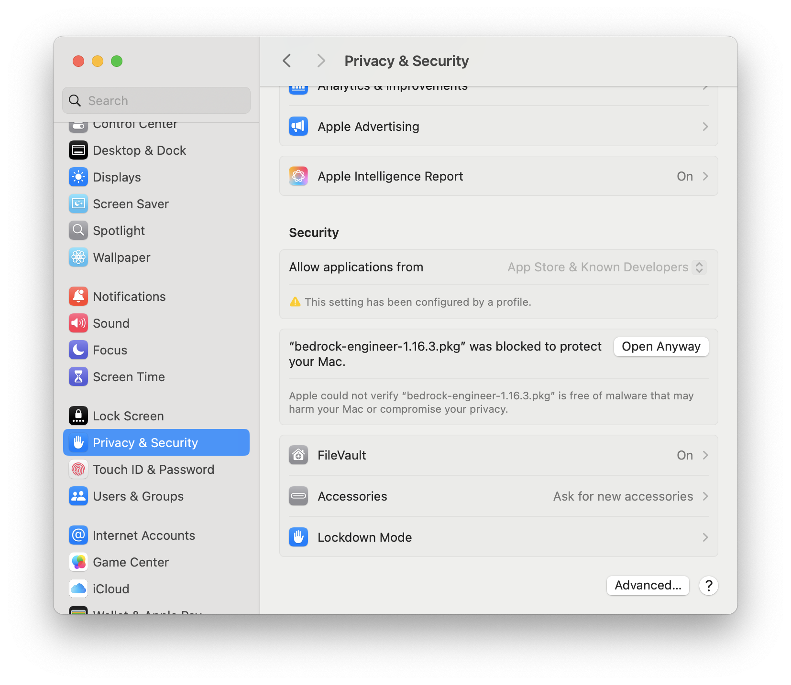
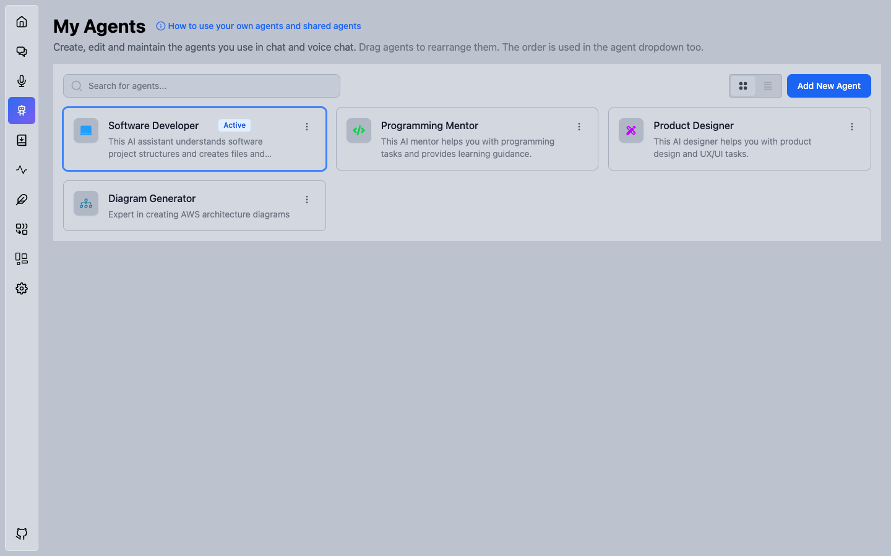
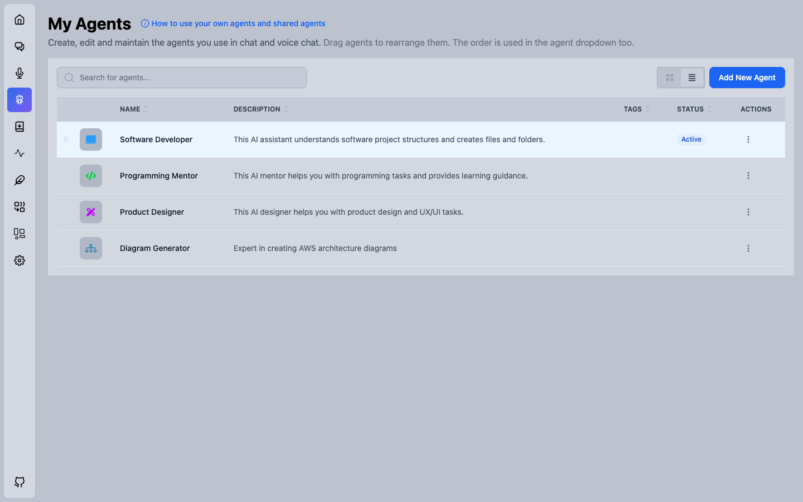
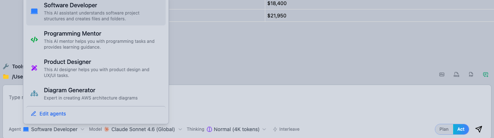
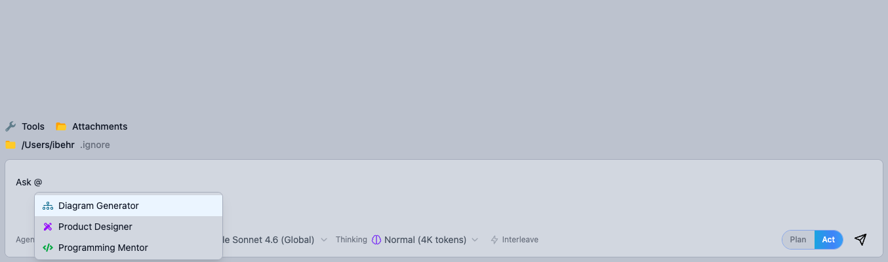
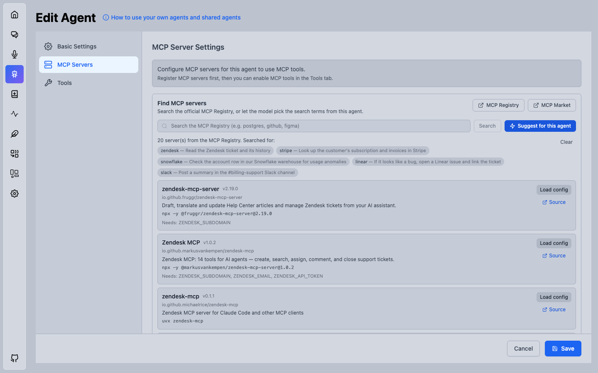
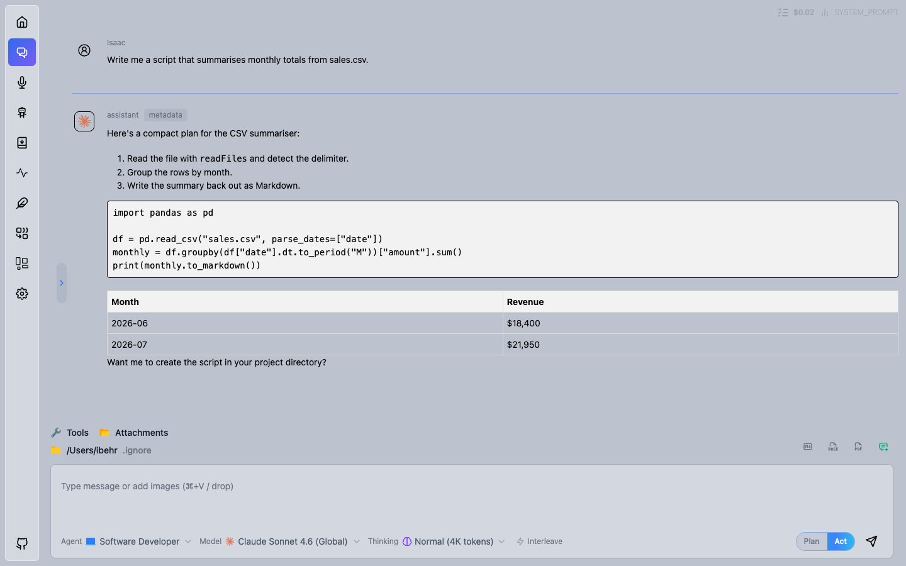
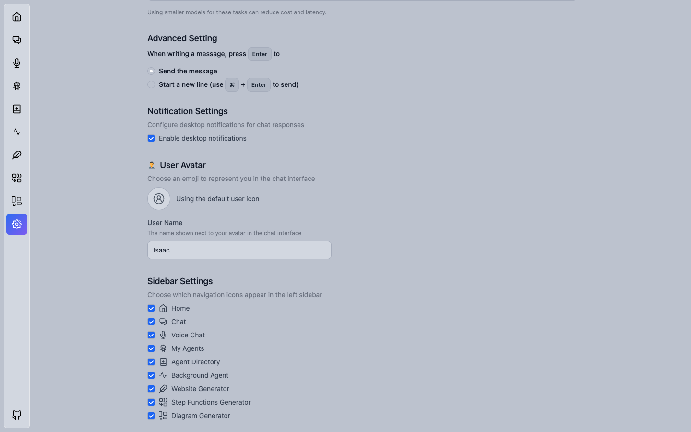
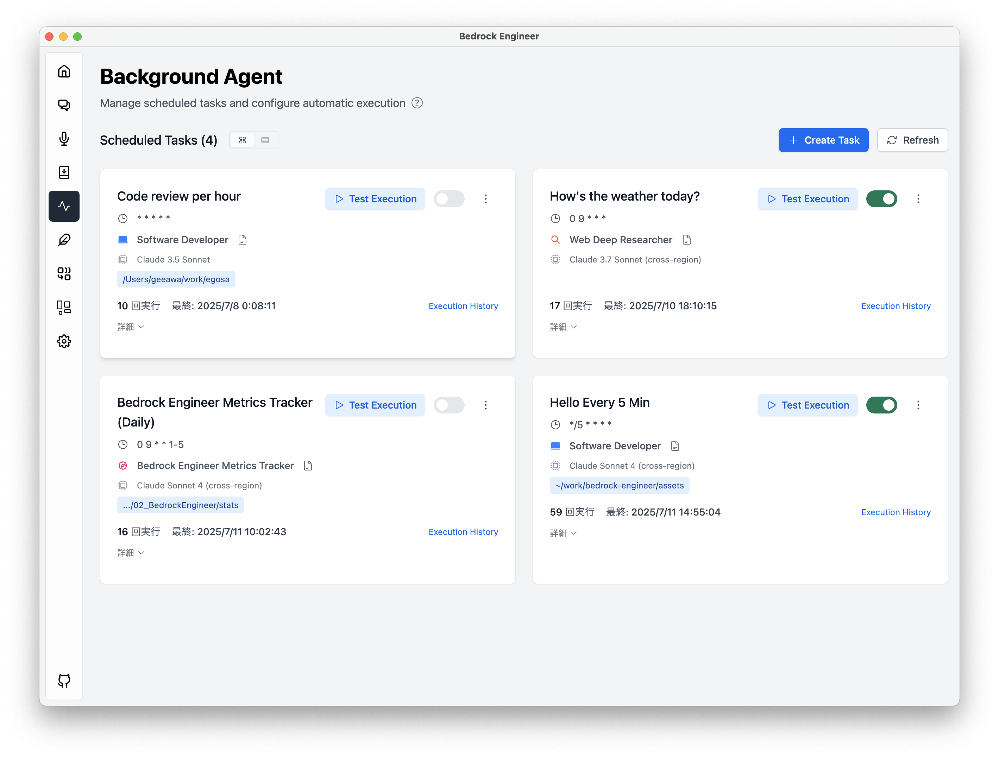
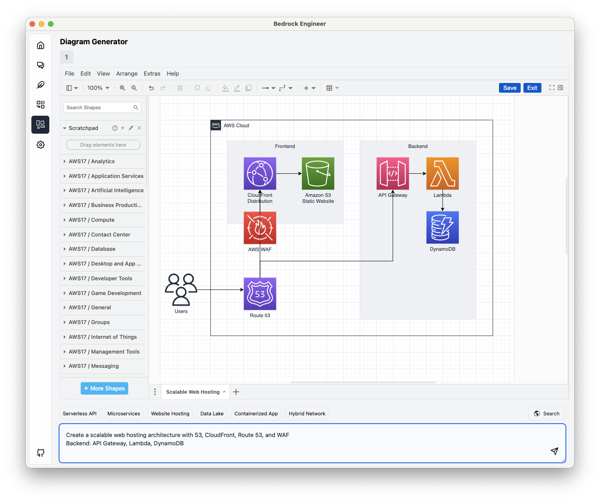

# Bedrock Engineer (Rust fork)

Original code here: https://github.com/aws-samples/bedrock-engineer

This repository is a fork of the original code with updates that deviate from upstream. Upstream
changes are no longer included in this fork. This fork is maintained independently and contains new
features and updates to keep models current. In addition, this fork moves from Electron to
Rust/Tauri.

Builds from this repo are versioned by date rather than with the original versioning scheme
(`YYYY.MMDD.N`): for example, version 2026.629.1 was the second change committed on 2026-06-29.

Bedrock Engineer is a desktop app for macOS, Windows and Linux that runs autonomous AI agents on
[Amazon Bedrock](https://aws.amazon.com/bedrock/), in your own AWS account. Agents can create and
edit files, run commands (on your machine with approval, or in a per-chat Docker sandbox), search
the web, query Bedrock Knowledge Bases, call Bedrock Agents and Flows, generate images and video,
use tools from MCP servers, and hand work to one another. Alongside the agent chat there are
scheduled background agents, an agent directory, and generators for websites, AWS architecture
diagrams and Step Functions workflows.

**New to the app, or looking for how something works?** The [User Guide](./docs/USER_GUIDE.md) is a
complete, plain-language walkthrough of every screen, every tool and every setting, with a question
index and a troubleshooting section. It is bundled into the app, and the **Help** button opens a
chat that answers from it.

The dated changelog is in [CHANGELOG.md](./CHANGELOG.md); its newest dated section is published as
the release notes for each build.

## Install

### Download

Installers for every build are attached to this fork's releases:

[](https://github.com/ibehren1/bedrock-engineer-rust/releases/latest)

| System                          | File                                                         |
| ------------------------------- | ------------------------------------------------------------ |
| macOS (Apple silicon and Intel) | `bedrock-engineer-rust-<version>-universal.dmg`              |
| Windows                         | `bedrock-engineer-rust-<version>-x64.setup.exe`              |
| Linux                           | `bedrock-engineer-rust-<version>-x64.AppImage` or `-x64.deb` |

### macOS

1. Open the DMG, accept the license, and drag **Bedrock Engineer** into Applications.
2. **Sign the app on your Mac (required).** Bedrock Engineer is self-signed (ad hoc), not signed with
   an Apple developer certificate, so each install has to be signed on the machine it runs on. Run
   this in Terminal after every install or update, before opening the app:

   ```bash
   sudo codesign --force --deep --sign - "/Applications/Bedrock Engineer.app"
   ```

   Without it the app may not work correctly, including the system permission dialogs for screen
   recording and the camera. From a checkout of this repo, `make sign` does the same.

3. Open the app. The first time, macOS may say it can't verify the developer, or that the app was
   blocked, because it isn't distributed through the Mac App Store. Click **Done**, open **System
   Settings → Privacy & Security**, scroll down to the Security section, find "Bedrock Engineer was
   blocked to protect your Mac", and click **Open Anyway**.

   

4. macOS asks for **Screen Recording** and **Camera** permission the first time an agent uses the
   screen or camera capture tools.

### Windows

Run the setup program. It isn't code-signed, so SmartScreen may show "Windows protected your PC":
click **More info**, then **Run anyway**. The app uses Microsoft Edge WebView2, which the installer
downloads if it is missing.

### Linux

Make the AppImage executable and run it (`chmod +x bedrock-engineer-rust-*.AppImage`), or install
the `.deb` with `sudo apt install ./bedrock-engineer-rust-<version>-x64.deb`.

### Set up AWS access

The app has no AI of its own: every answer comes from a model in Amazon Bedrock in your AWS account,
billed by AWS. Open **Settings → AWS** and enter an access key and secret, or the name of an AWS
profile, and pick a region. If Bedrock is new to you, follow
[Setting up access to Amazon Bedrock](./docs/USER_GUIDE.md#4-setting-up-access-to-amazon-bedrock). It
covers enabling models in the Bedrock console, the IAM policy, creating access keys, installing the
AWS CLI, and writing the `~/.aws/credentials` and `~/.aws/config` files.

### Where settings and history live

Settings (`config.json`), chat history (`chat-sessions/`, `chat-sessions-meta.json`) and logs
(`logs/`) are kept in one folder named after the app:

| System  | Folder                                            |
| ------- | ------------------------------------------------- |
| macOS   | `~/Library/Application Support/Bedrock Engineer/` |
| Windows | `%APPDATA%\Bedrock Engineer\`                     |
| Linux   | `~/.config/Bedrock Engineer/`                     |

This is separate from upstream Bedrock Engineer's `bedrock-engineer` folder. Builds of this fork
from before the rename used a different folder name; the app moves that folder to the new location
the first time it starts. The exact path is shown in **Settings → Workspace → Config Directory**.

If the app won't start because of a configuration error, move `config.json` out of that folder and
start the app again. If it still fails, please file an issue.

## What's different in this fork

### A native app, built in Rust

Upstream Bedrock Engineer is an Electron app. This fork runs the same React interface in
[Tauri](https://tauri.app/) with a Rust backend (`src-tauri/`) in place of Electron's Node.js main
and preload processes: Bedrock calls, tools, MCP clients, the Docker sandbox, background agents and
settings storage are all Rust. The installers are much smaller and the app starts faster, because
it no longer ships its own copy of Chrome and Node.js — it uses the operating system's web view
(WebKit on macOS and Linux, WebView2 on Windows).

Settings, agents and chat history from the Electron builds of this fork carry over on first launch.
On macOS the Tauri app has a new identity, so the system asks once more for Screen Recording and
Camera permission. Voice Chat (Nova Sonic) did not come along.

### Help, without leaving the app

A **Help** button sits in the bottom-left corner, just above the GitHub link. It opens a chat called
"Bedrock Engineer Help" with the user guide already attached, so you can ask how something works and
get an answer taken from the guide instead of guessed at. The guide is bundled into the build, so it
always matches the version you are running and works offline.

The help chat runs on whichever model you chose as the **Light Processing Model** in Settings — the
guide is long, and a small model keeps it cheap — falling back to your main conversation model if
that setting is empty. It deliberately has no tools, so it cannot read your files or inspect your
settings; it answers from the guide and says so when the guide does not cover your question. Clicking
Help again continues the same conversation rather than starting a new one.

If you have not set a project directory yet, the guide cannot be saved as a chat attachment. Help
still works — the guide is given to the agent directly, and a note explains why no attachment is
listed.

### My Agents

Agents are created and maintained on a **My Agents** page that opens in the main window, with its
own sidebar button. It replaces the "Custom Agents" overlay that upstream opens on top of the chat.



- Create, edit, duplicate, export and remove agents from one place. Clicking an agent opens its
  editor rather than switching the active agent.
- **Move agents in and out as files.** **Download YAML** in an agent's ⋮ menu writes its
  configuration to a file you pick, stripped of the internal id and the flags recording where your
  copy came from so it is portable. **Import Agent**, beside Add New Agent, reads such a file back in
  as one of _your_ agents — editable, with a fresh id, rather than the read-only kind you get from a
  project's shared folder.
- **Un-share an agent.** Once an agent has been written into a project's
  `.bedrock-engineer/agents/` folder, **Delete Shared File** in its ⋮ menu removes that file after
  confirming the full path. Your own copy is untouched; only the copy everyone opening the project
  sees goes away. Upstream has no way to undo sharing from inside the app.
- **Hide the built-in agents you don't use.** Upstream re-seeds its built-in agents into the store
  on every launch, so deleting one never stuck. **Hide** now persists across restarts, and the
  **Unhide** dropdown lists every hidden agent so you can bring them back one at a time or all at
  once. Agents you created yourself are deleted outright instead of hidden.
- **Rearrange agents by drag and drop**, in either card or table view. The arrangement is saved and
  is reused by the agent dropdown and `@` mentions. Dragging is disabled while a table column sort
  is active.



### Picking an agent icon from ~38,000 icons

The icon button in an agent's **Name & Icon** row opens a picker that still starts on the curated,
categorised list, and adds ten icon collections to browse or search by name — Tabler, Lucide,
Phosphor, Material, Heroicons, Bootstrap, Font Awesome (plus brands), Simple Icons and Game Icons.
Choose **All libraries** to search across all of them at once; long result lists are capped, so
narrow the search to see more. Collections are loaded the first time you open one, so app startup is
unaffected, and icons chosen before this change keep working.

### Choosing an agent from the message entry area

The agent picker is a dropdown in the message entry area, left of the model selector, and the three
controls there are labeled **Agent**, **Model** and **Thinking**. "Edit agents" jumps to the My
Agents page.



### Delegating a task to another agent with `@`

Type `@` followed by an agent name to hand one step of a task to that agent. The other agent runs
with its own tools and system prompt, and its result comes back to the agent you are talking to — no
switching back and forth. For example, `use @email to find the email from Kevin and compose a reply`.



### Finding MCP servers

The agent editor's **MCP Servers** tab searches the
[official MCP Registry](https://registry.modelcontextprotocol.io) — type a term, or press **Suggest
for this agent** to have the model derive the search terms from the agent's description, system
prompt and enabled tools.



Every server listed comes from the registry, so names, versions, package identifiers, required
environment variables and hosted endpoints are real: "Load config" fills the JSON editor with a
version-pinned command (or the remote URL) for you to review before adding it. The model only ever
produces the search terms, never a package name.

Those terms have to be grounded in the agent's own configuration — its system prompt, scenarios,
allowed shell commands, description and additional instruction — and each one is shown with the
phrase it came from. A support agent whose prompt mentions Zendesk, Stripe, Snowflake, Linear and
Slack gets exactly those five searches, not "automation" or "devops"; generic category words are
rejected, and if nothing in the configuration names a system, it says so rather than guessing.

[MCP Market](https://mcpmarket.com) is linked for browsing by category, chosen from the same agent
signals. It's link-out only: it publishes no API, its `robots.txt` disallows `/api/` for everyone,
and automated requests get a Vercel bot challenge, so the app doesn't read it.

MCP servers started with `npx`, `uvx` and similar commands see your login shell's `PATH` on macOS
and Linux, even when the app is opened from the Dock or a desktop launcher. Configuration details
are in the [MCP Server Configuration Guide](./docs/mcp-server/MCP_SERVER_CONFIGURATION.md).

### Chat interface



- Each turn is labeled with your configured **user name** and avatar, and with the **model icon** of
  the model that produced the answer (hover it for the model name).
- The **running conversation cost** is shown at the top right, next to the token analytics and TODO
  icons.
- **Export the conversation** as Markdown, Word (`.docx`) or PDF from the buttons above the input
  box. All three exclude tool use/results, label turns as `Assistant – <model ID>` / `User – <name>`,
  and embed the avatars. Word and PDF render Mermaid and DrawIO diagrams as images; the Markdown
  export keeps Mermaid diagrams as ` ```mermaid ` code blocks so they stay editable and are
  rendered by GitHub, VS Code and Obsidian, and writes DrawIO diagrams and other images to an
  `images/` folder next to the `.md` file.
- Select text in a message to get a **floating toolbar** that copies just the selection as Markdown
  or rich text; whole messages can be copied either way too.
- The stop-generation button is red while inference runs; the new-conversation button is green.
- **Answers keep running in the background.** Switching to another chat, starting a new one, or
  leaving the Chat page no longer cancels an agent mid-turn — it keeps calling tools and the reply is
  waiting when you return. Chats still working are marked "Still responding" in the history list, and
  stop only ever stops the chat on screen. Reloading the window still cancels everything.
- The **chat history panel starts open** when you go to Chat.
- Each chat in the history carries a **paperclip** when it has attached files and a **whale** when it
  has a Docker sandbox, both in the row's own text colour, so you can see which conversations have
  something on disk behind them without opening each one.
- Streaming output auto-scrolls through the tool-use phase and then stops, and respects a manual
  scroll up.
- **Attachments are files in your project, per chat.** Drop, paste or pick a file and it is written
  to `attachments/<chat-title>-<id>/` immediately — images included, so nothing is held in the
  message box. A paperclip button next to the export buttons badges the file count and opens a menu
  to list, delete, add and reveal them. Their contents are rebuilt from the folder on every message,
  so editing or removing a file changes what the agent sees next without re-attaching; long files are
  trimmed with a pointer to read the rest, and formats nothing can extract are passed along as paths.
  Deleting the chat deletes its attachments folder.
- Chat history supports multi-select delete.

### A Docker sandbox per chat

Turning on the **Docker Sandbox** tool gives each chat its own long-lived container based on
`ubuntu:26.04`, and makes it the default place the agent runs commands. The agent can `apt-get
install` whatever it needs and make a mess without any of it reaching your machine — and because it
cannot reach your machine, the command allowlist doesn't have to hold it back inside the container.

- Your project directory is mounted read-write at `/workspace`, so files move in and out freely, and
  the agent can publish ports if you want to open what it built in a browser. Long-running processes
  can be started in the background and their output read back later.
- Running a command on **your own machine** instead has to be asked for explicitly, and you get a
  dialog with the exact command before anything runs — allow it once, or for the rest of that chat.
- The Docker whale next to the export buttons appears whenever the current chat has a container, and
  can stop, start or remove it, open its folder in Finder, Explorer or your Linux file manager, and
  open the sandbox panel.
- **A sandbox panel** slides in from the right of the chat, on a tab next to the chat history's. It
  shows what the container actually is — image, how long it has been up, CPU, memory, network and disk
  against their limits — lists each service with its published ports as links that open in your
  browser, and keeps an **Activity** log of every command the agent ran there: when, how long it took,
  and whether it finished, failed, stopped for input, was left running in the background, or timed
  out. That log is kept in the sandbox's own folder, so it is still there after a restart.
- **A Compose tab** for stacks: a diagram of the services with their images and states, the published
  ports that reach them from your browser, the folders mounted into them, and the compose file itself
  underneath. Click the diagram to open it full window.
- **An interactive terminal** in that panel gives you a real shell inside the container, with colours,
  full-screen programs like `vim` and `htop`, resizing and Ctrl-C — and a tab per container when the
  sandbox is a compose stack. It is the fastest way to see what the agent left behind or to fix
  something by hand. Because it is a genuine root shell with your project mounted at `/workspace`,
  nothing you type is filtered or approved — the app says so once, before the first time you open it.
  The model cannot reach this shell: there is no tool for it.
- Containers survive switching chats, are stopped when you quit, and come back with their installed
  packages intact. Compose and data files live in `docker-sandboxes/<chat-title>-<id>/` in your
  project directory as ordinary mapped folders, and the folder is renamed to follow the chat's title.
- Deleting a chat removes its container; the delete dialog offers to delete the sandbox's data folder
  too, unchecked by default, so anything the agent wrote is kept unless you say otherwise.

Requires Docker (Docker Compose is used when available, and is needed for multi-service stacks). If
Docker is missing, the agent tells you how to install it for your platform. The terminal additionally
needs Docker to be local — Docker Desktop, OrbStack, Colima and rootless installs all work, but a
context pointing at a remote daemon disables that tab and says why; the rest of the panel still works.

### Models

- Added Claude Fable 5.1, Fable 5, Opus 5.5, Opus 5, Sonnet 5.5, Sonnet 5 and Opus 4.8, Kimi K3,
  Kimi 2.5, xAI Grok 4.7 and 4.6, the OpenAI GPT-6.1 Sol, GPT-6 (Astra/Sol/Luna) and GPT-5.6
  (Sol/Terra/Luna) models, all served through the standard Bedrock Converse API.
- Adaptive thinking for newer Claude models, with the thinking type translated per model so
  switching model generations doesn't 400. On models that expose reasoning-effort levels rather than
  a thinking budget — Grok 4.7, Grok 4.6 and the GPT-6.1, GPT-6 and GPT-5.6 models — **Deeper** asks
  for the highest effort the model offers.
- Model pricing kept current, and per-model input/output pricing shown in the model dropdown.
- **Max Tokens is capped per model.** Every request sends the lesser of your Max Tokens setting and
  the model's own output ceiling, so one high setting works across models instead of being rejected
  by the smaller ones.
- **Model allowlist** in settings, so the dropdown can be trimmed to the handful of models a given
  user should see.

### Appearance and layout



- **Settings are grouped into five tabs** — General, AWS, Models, Chat and Workspace — with a
  sidebar down the left, rather than one long column. Each tab has its own address
  (`#/setting/aws`), so links into settings open the relevant tab.
- **Five appearances**, lightest to darkest — Light, **Newspaper**, Dim (default), **Charcoal** and
  Dark. Newspaper is a flat, monochrome, black-on-white view in the spirit of a printed page or an
  e-ink reader: square corners, hairline rules, no shadows, and colour reserved for success and error
  states. Charcoal is a warm grey with an amber accent.
- **The app has its own typeface, and you can choose it.** Text is set in Inter and code in JetBrains
  Mono by default, both bundled so they render identically on every platform with no network. Settings
  → Appearance offers Inter or Geist for interface text and JetBrains Mono or Geist Mono for code as
  two separate settings, because JetBrains Mono makes `1`, `l`, `I` and `0`, `O` easier to tell apart
  when you're reading a tool-use ID or a file path.
- Every text size carries a line height and letter spacing chosen for it, figures are fixed-width so
  live token counts and costs don't shift as digits change, and one set of corner radii applies
  throughout: 6px on controls, 8px on containers, fully round only for avatars and count badges.
- **The window reopens where you left it**, at the same size and position, and maximized if it was
  maximized. A position that is off-screen on the monitors you have now is brought back into view,
  and a size too large for them falls back to the default.
- **Sidebar Settings** hides any navigation icon you don't use.
- Pick an emoji avatar and a display name for yourself in the chat.
- A reworked app icon.
- Japanese translations for the AWS and Language settings, which previously showed only in English.

## More of what the app does

These features come from upstream Bedrock Engineer and work the same way here; the User Guide has
the details.

- **Tools.** File reading and writing (including Excel as CSV), command execution with an allowlist,
  web search (Tavily) and page fetching, image generation and recognition, Nova Reel video
  generation, Bedrock Knowledge Base retrieval, Bedrock Agents and Flows, a Python code interpreter
  in Docker, and screen and camera capture. Tools are switched on per agent. See
  [the complete tool reference](./docs/USER_GUIDE.md#9-the-complete-tool-reference).
- **Background agents.** Run an agent on a cron schedule, keep its conversation across runs, run it
  on demand, and get a notification with the result. See
  [Background Agent](./docs/USER_GUIDE.md#14-background-agent-work-on-a-schedule).

  

- **Agent Directory.** Browse, search and add ready-made agents, or share agents across a team
  through S3 (see the [Organization Sharing Guide](./docs/agent-directory-organization/README.md)).
  See [Agent Directory](./docs/USER_GUIDE.md#13-agent-directory).
- **Website Generator.** Generate React, Vue, Svelte or vanilla JS sites with a live preview,
  optionally grounded in a Knowledge Base (for example your design system) or in web search. See
  [Website Generator](./docs/USER_GUIDE.md#15-website-generator).
- **Diagram Generator.** Turn a description into an AWS architecture diagram in draw.io format. See
  [Diagram Generator](./docs/USER_GUIDE.md#16-diagram-generator).

  

- **Step Functions Generator.** Generate and preview Step Functions ASL definitions. See
  [Step Functions Generator](./docs/USER_GUIDE.md#17-step-functions-generator).
- **Application inference profiles** for tracking Bedrock costs by project or team. See the
  [Application Inference Profile Guide](./docs/inference-profile/INFERENCE_PROFILE.md).
- **Custom Model Import** models can be used too. See the
  [Custom Model Import Configuration Guide](./docs/custom-model-import/README.md).

## Build from source

### Prerequisites

- Node.js 24 or later.
- A Rust toolchain (stable, via [rustup](https://rustup.rs/)).
- **macOS:** the Xcode command-line tools (`xcode-select --install`).
- **Windows:** the Microsoft C++ Build Tools and WebView2 (see
  [Tauri's prerequisites](https://tauri.app/start/prerequisites/)).
- **Linux:** the WebKitGTK development packages Tauri needs (see
  [Tauri's prerequisites](https://tauri.app/start/prerequisites/)). The exact `apt-get` list the
  release build uses is in `.github/workflows/build-and-release.yml`.

### Build and install on macOS

```bash
make build-mac     # installs npm packages, adds the Rust mac targets, builds the universal .app + .dmg
make install       # opens the new .dmg; drag Bedrock Engineer into Applications
make sign          # sign the installed app (required, as for downloaded builds)
```

The `.app` and `.dmg` are in
`src-tauri/target/universal-apple-darwin/release/bundle/`. `make build-native` builds for this Mac's
architecture only, which is faster; its output is in `src-tauri/target/release/bundle/`.

### Build on Windows or Linux

```bash
npm ci
npm run build:win      # Windows: NSIS -setup.exe
npm run build:linux    # Linux: .AppImage and .deb
```

The installers are in `src-tauri/target/release/bundle/`.

### Develop

```bash
npm ci             # once, and after dependency changes
npm run dev        # run the app; the interface hot-reloads and the Rust side rebuilds on change
make test          # Rust and JavaScript unit tests (what CI runs)
npm run typecheck && npm run lint
```

`npm run dev` uses your real settings and chat history. Other `make` targets: `make version` prints
the version the current commit builds as, `make notices` regenerates the third-party license
notices, and `make sign` re-signs the installed app. [CLAUDE.md](./CLAUDE.md) describes the code
layout, and [docs/release-guide.md](./docs/release-guide.md) covers versioning, releases, code
signing and build troubleshooting.

### Releases

A GitHub Actions workflow builds the macOS, Windows and Linux installers on every push to `main` and
publishes them as a release, with the newest section of [CHANGELOG.md](./CHANGELOG.md) as the
release notes. Each installer ships third-party license notices for every bundled Rust crate and
npm package.

## Documentation

- [User Guide](./docs/USER_GUIDE.md) — a complete, non-technical walkthrough of every page, tool and
  setting, with a "how do I…" question index, a glossary and a troubleshooting section.
- [Setting up access to Amazon Bedrock](./docs/USER_GUIDE.md#4-setting-up-access-to-amazon-bedrock) —
  start-to-finish AWS setup, including profiles, session tokens and IAM Identity Center.
- [MCP Server Configuration Guide](./docs/mcp-server/MCP_SERVER_CONFIGURATION.md)
- [Organization Sharing Guide](./docs/agent-directory-organization/README.md)
- [Application Inference Profile Guide](./docs/inference-profile/INFERENCE_PROFILE.md)
- [Custom Model Import Configuration Guide](./docs/custom-model-import/README.md)
- [Release guide](./docs/release-guide.md)

## Attribution / Provenance

- **Original application:** [Bedrock Engineer](https://github.com/aws-samples/bedrock-engineer) by
  Amazon.com, Inc. (aws-samples/bedrock-engineer), licensed MIT-0. The React interface, the agents,
  the tools and much of the documentation come from it.
- **Fork:** "Bedrock Engineer Rust Fork", maintained and extended by Isaac Behrens, with the changes
  described in [What's different in this fork](#whats-different-in-this-fork) and
  [CHANGELOG.md](./CHANGELOG.md).
- **Rust/Tauri port:** the fork's Electron main and preload processes, rewritten by Isaac Behrens
  as the Rust backend under `src-tauri/`, with the same interface on top.

The [NOTICE](./NOTICE) file carries the same trail; third-party license notices for everything the
app bundles are in [notices/](./notices/).

## Security

See [CONTRIBUTING](CONTRIBUTING.md#security-issue-notifications) for more information.

## License

This project is licensed under the MIT-0 License. See the [LICENSE](./LICENSE) file.

This software uses [Lottie Files](https://lottiefiles.com/free-animation/robot-futuristic-ai-animated-xyiArJ2DEF).
